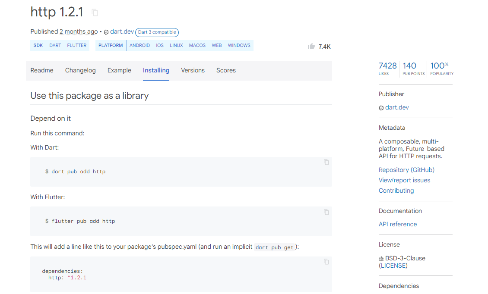

# app9

Un nuevo proyecto de Flutter.

## Empezando

Este proyecto es un punto de partida para una aplicación Flutter.

Algunos recursos para ayudarte a comenzar si este es tu primer proyecto de Flutter:

- [Lab: Write your first Flutter app](https://docs.flutter.dev/get-started/codelab)
- [Cookbook: Useful Flutter samples](https://docs.flutter.dev/cookbook)

Para obtener ayuda para comenzar con el desarrollo de Flutter, consulte la
[online documentation](https://docs.flutter.dev/), que ofrece tutoriales,
ejemplos, orientación sobre desarrollo móvil y una referencia API completa.

# Vista previa de la app9 - Consumir una API RESTful

## Código de la primera pantalla

## Primera pantalla

## Instalar la dependecia http

Para instalar la dependencia visite la siguiente URL:

- [ https://pub.dev/ ](https://pub.dev/)

## Crear una carpeta models y construir la clase Company

## Crear una propiedad de tipo future y un método que retorne un future

## Importar el paquete http y darle el alias http

## Traer el método initState() y llamar el método getCompanies().

## Vista en la terminal.

### Convertir la API RESTful a un json y con un ciclo for crear una lista de objetos Company.

### Asignar a el future listCompanies el método getCompanies() en el initState().

### En la propiedad body del HomeScreen crear el widget FutureBuilder.

### Crer un método verCompanies() que va a retornar una lista de widgets.

## Segunda pantalla

### Agregar a la lista de widgets companies un Card() con un hijo ListTile() que se va retornar.

## Tercera pantalla

### Agregar las propiedades leading y trailing al ListTile().
### Construimos el CircleAvartar().

## Cuarta pantalla

### Todo el código del HomeScreen acá.

